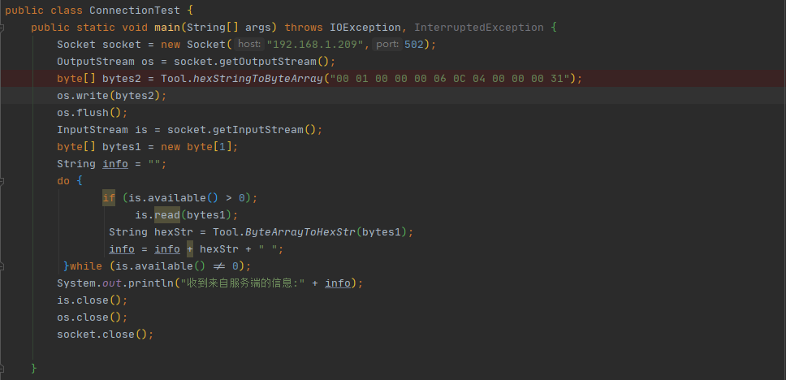
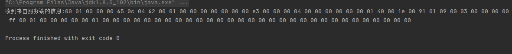
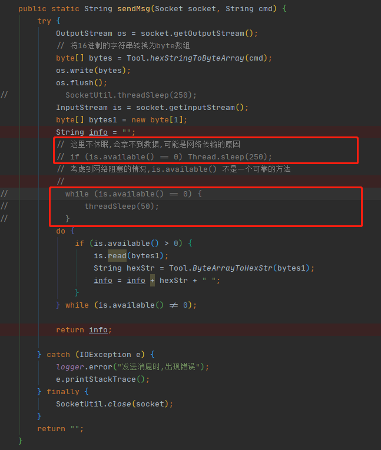
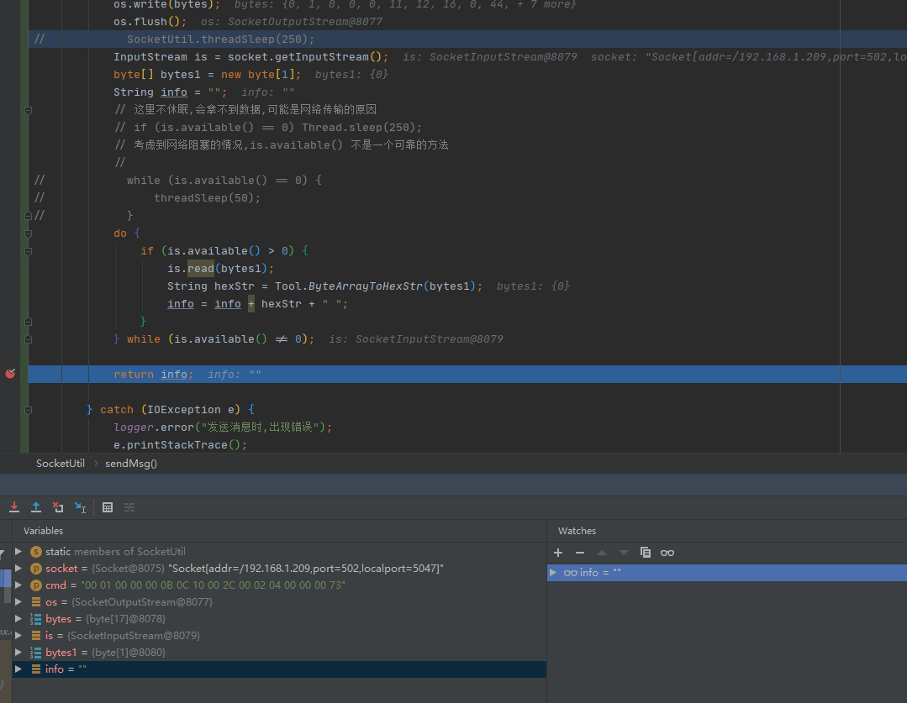
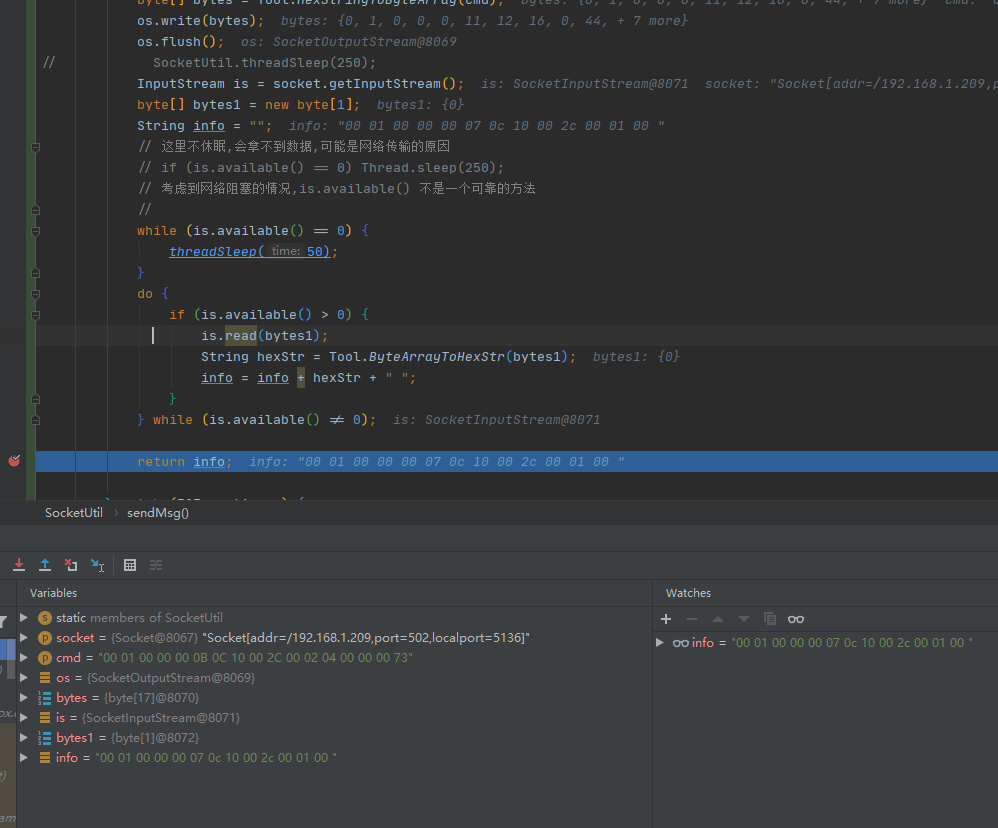
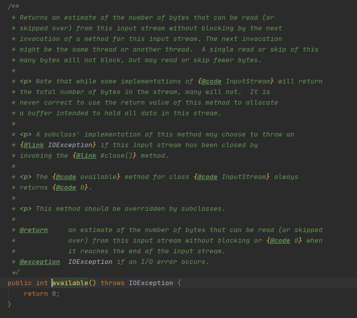

# 使用 Socket inputstream 无法获取数据的问题

- 场景重现：在一次开发的中，项目经理给了一个 demo，有一部分内容是通过 socket 与智能设备建立连接。单机的 demo 是通过 Main 方法运行的，下面给出代码片段和运行结果。

  

可以看到通过这种方式，是可以获取到设备的返回值的。

于是我把这一部分放到了项目里面，下面直接上截图。

当项目启动运行到这段逻辑的时候，会发现返还回的info是一个空的字符串，但是以debug模式启动，并加上断点发现又可以获得设备返回的信息，十分诡异。下面附上运行的截图						（图中注释掉的部分是我后面的解决办法。）

1. 上图演示直接运行的情况，可以看到info= ""

2.当给线程加上了休眠之后，info就有值了。

于是我就去探究为什么会出现这种诡异的现象：

1.显示看源码对inputstram对available方法的解释:

大概的翻译是：“ 返回可以从此输入流读取（或跳过）而不会被该输入流的方法的下一次调用阻塞的字节数的估计值。下一个调用可能是同一线程或另一个线程。仅读取或跳过此多个字节不会阻塞，但可能会读取或跳过较少的字节。

请注意，虽然的某些实现`InputStream`会返回流中的字节总数，但许多实现不会。使用此方法的返回值分配旨在容纳该流中所有数据的缓冲区永远是不正确的。”

我对注意中的理解是，available并不是每次都返回给你准确的数字，所以不能用这个方法去判断该流是否存在尚未返回的字节。推测由于是网络的影响导致inputstram的available返回了0，所以在项目中直接运行才会没有正确的给出返回值。

### 解决办法

当知道设备一定会给你返回信息的时候，让线程休眠一会，直到available 不为0 ，才接着向下运行。

### 参考

https://docs.oracle.com/javase/7/docs/api/java/io/InputStream.html#available()

https://blog.csdn.net/CNHK1225/article/details/34429317