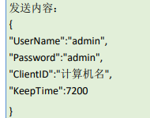
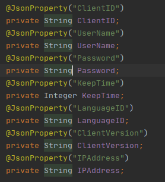
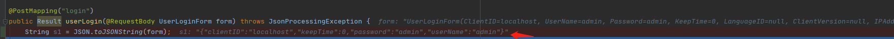

## @JsonProperty 和@JsonFeild 的区别

### 问题场景

在实际开发的时候,需要对接第三方的接口,他们的接口的数据格式是 json 中 key 有大写的如下图



这个时候使用@RequestBody 注解发现会拿不到参数.

### 错误出现的原因

由于注入时，使用的是 setName(...),setSex(...)，按照 java 的命名规范，对应的变量，name 和 sex 会被赋值，但是如果变量命名为 Name 和 Sex 的话，虽然生成的 setter 函数依然是 setName(...),setSex(...)，但是 spring 框架注入时就无法分辨到底是 name 还是 Name，依然会按照命名规则来，所以依然会给 name 赋值，如果恰好没有按照命名规则来，使用的是 Name 的话，就无法完成注入。

### 解决办法

使用@JsonProperty 注解



加上这个注解之后，就能成功的从请求体中拿到参数了。但是使用com.alibaba.fastjson.JSON.toJSONString()方法序列化对象时又出现了新的问题。发现序列化的结果又变成了首字母小写的字符串.




经过搜索后发现使用

**@JsonProperty**注解,实现：json转模型时，使json中的特定key能转化为指定的模型属性；同样的，模型转json时，对应的转换后的key为指定的key, 但是对应的方法是:

```java
New objectMapper().writeValueAsString()// 反序列化
New ObjectMapper().readValue()// 序列化
```

 **@JsonFeild** 是fastjson的注解, 对应的方法是 :

```java
JSON.toJSONString() // 序列化
JSON.parseObject() // 反序列化    
```

这样就明白了,springboot使用的是jackson中@JsonProperty注解进行反序列化的,所以前端传来的参数可以被成功的识别,但是如果用JSON.toJSONString()方法进行序列化,自然就无法实现将对象序列化为自定义的值.

解决办法有两个: 一是在属性上添加  @JsonFeild 注解,然后使用**JSON.toString()**方法,

二是直接使用**New ObjectMapper().readValue()** 即可


### 参考

​	来自:<https://blog.csdn.net/justry_deng/article/details/80972817>

​	来自 <https://blog.csdn.net/qq_26075861/article/details/54016591> 